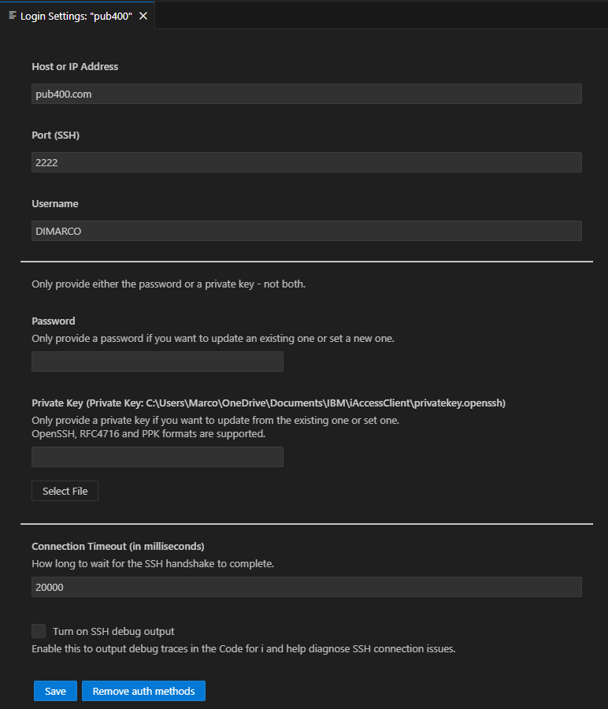
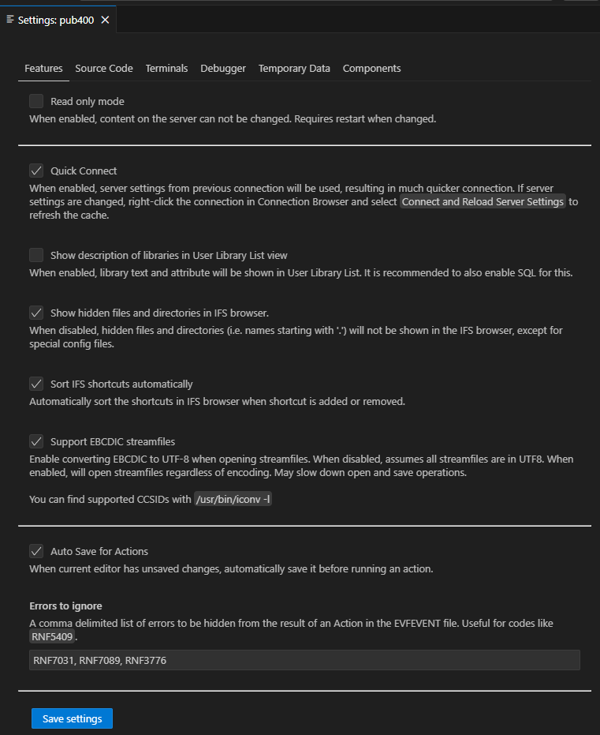
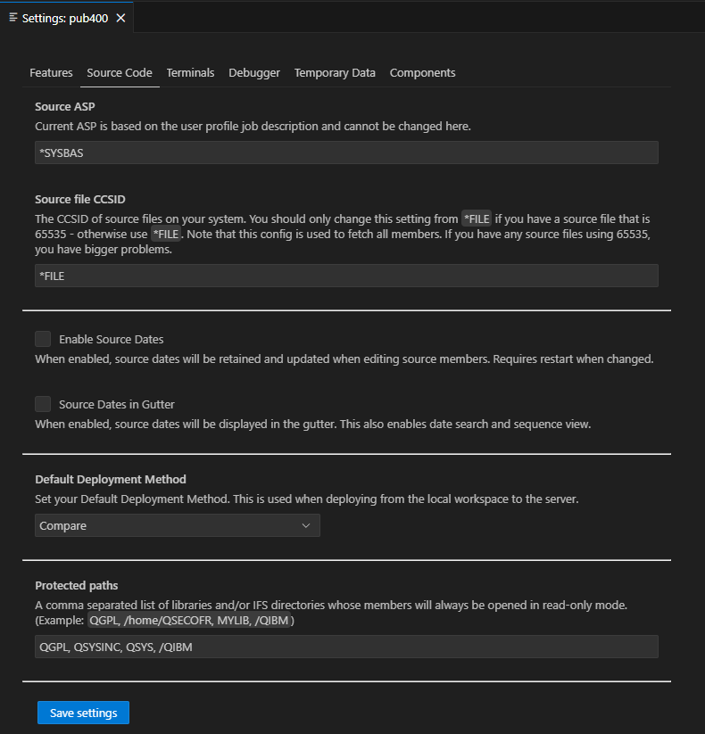
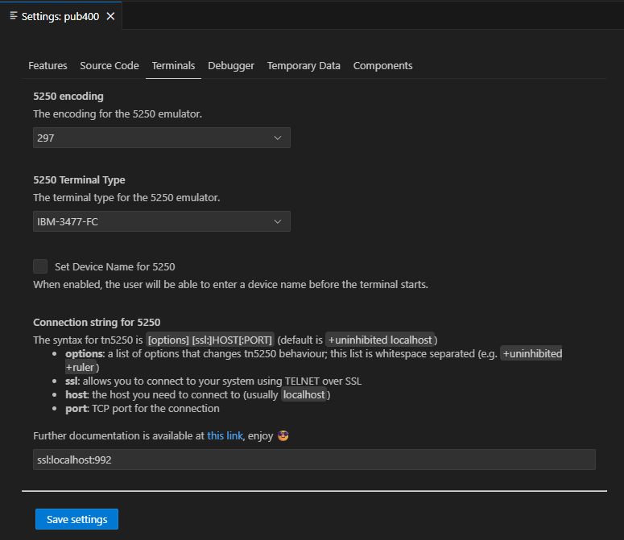
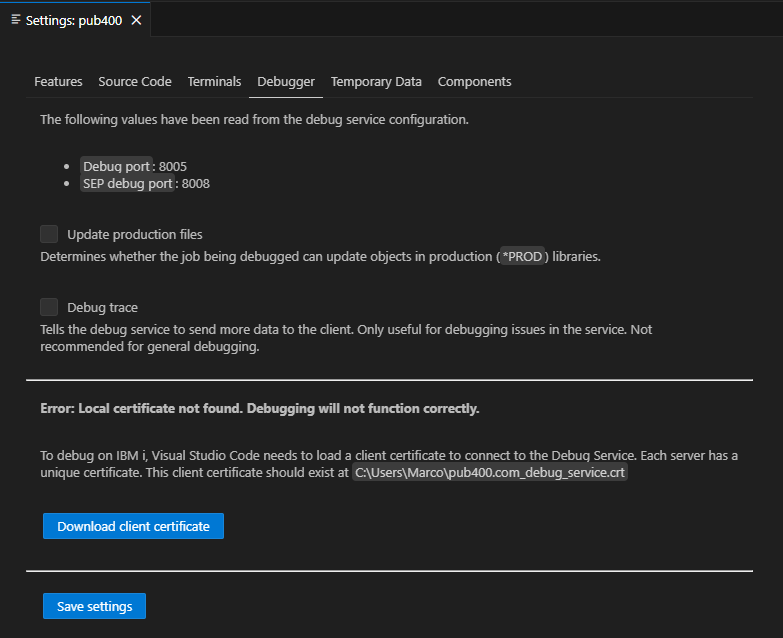
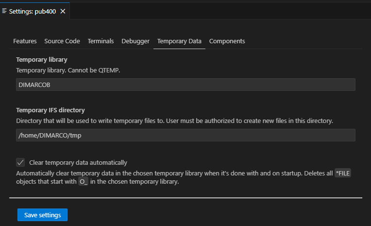
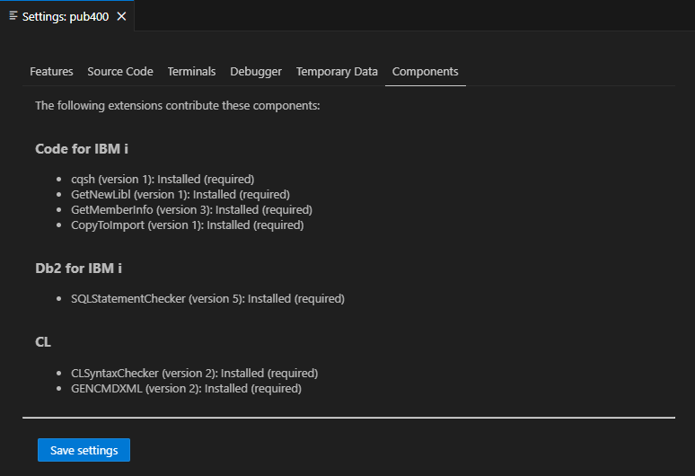

# Development tools

## Visual Studio Code and Code 4 i

VSCode and **all IBM i related extensions** is used for all development activity applying on PUB400. There is no specific setting within all the various parameters of the software, however there are a couple of ones for the extensions got through the "IBM i Development Pack", that one can install through VS Code extensions capabilities.

Download site: [Download Visual Studio Code](https://code.visualstudio.com/Download).

All the settings below are related to Code4i, that you get installed through the extension management procedures.

- Login settings
  - Host or IP Address: pub400.com
  - Port (SSH): 2222
  - Username: my_userprofile_on_PUB400
  - Password: not used
  - Private key: the full path to openssh key file
  - connection timeout: 20000 (sometimes, it might be needed to set a higher value here such as 30000 or more)
  - Turn on SSH debut output: unselected (might be selected to debug ssh errors, such as invalid private/public keys pair)

(check out [Using an ssh keys pair to login.md](Using%20an%20ssh%20keys%20pair%20to%20login.md) for more details on the way to create this openssh key file)

Note: Code4i stands that it supports ppk files for ssh authentication but, for some reasons, ppk files created with my putty installation do not work while openssh files do the job.

- Connection settings/Features
  - Read only mode: not selected
  - Quick Connect: selected
  - Show description of libraries in User Library List view: not selected
  - Show hidden files and directories in IFS browser: selected
  - Sort IFS shortcuts automatically: selected
  - Support EBCDIC streamfiles: selected
  - Auto Save for Actions: selected
  - Errors to ignore: RNF7031 (The name or indicator is not referenced.), RNF7089 (RPG provides Separate-Indicator area for file), RNF3776 (External program on prototype for main procedure is not the same as program being created)

- Connection Settings/Source Code
  - Source ASP: *SYSBAS
  - Source File CCSID: *FILE
  - Enable Source Dates: not selected
  - Source Dates in Gutter: not selected
  - Default Deployment Method: Compare
  - Protected paths: QGPL, QSYSINC, QSYS, /QIBM

- Terminals (note: 5250 emulation from VSCode is not used)
  - 5250 encoding: 297 (for French language)
  - 5250 Terminal Type: IBM-3477-FC
  - Set Device Name for 5250: not selected
  - Connection String for 5250: ssl:pub400.com 992

Note: I don't really use 5250 emulation within Code4i, as I prefer the one provided through iACS.

- Debugger
  - Update production files: not selected (note: our libraries are PROD ones)
  - Debug trace: not selected
  - Debug securely: not selected
  - Local certificate: at writing time, debugging is not properly set on PUB400

- Temporary Data
  - Temporary library: DIMARCOB (note: this is important to set as VSCode will create temporary objects in this library, and will not properly work if it cannot proceed for any reason (do not forget that we cannot create libraries on PUB400))
  - Temporary IFS directory: /home/my_userprofile_on_PUB400/tmp
  - Clear temporary data automatically: selected

There is nothing to set it, as it shows a report of required and optional components installation status.

## github repository synchronization tools

In order to synchronize my laptop files with my github repositories, I use both [Git for Windows](https://gitforwindows.org/index.html) as a git bash shell commands and [Github Desktop](https://github.com/apps/desktop) as a GUI for git commands. I never use any git integrated commands within VS Code, only using them to list the changes on the files. Indeed, I always GitHub Desktop to handle git actions.
