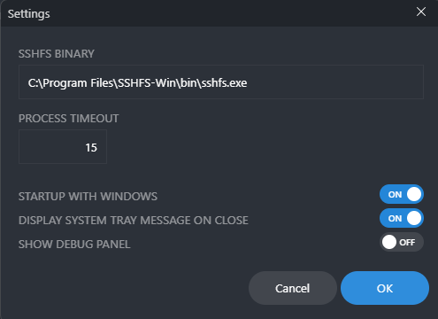
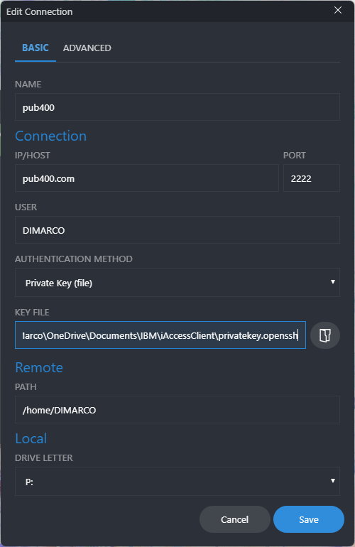
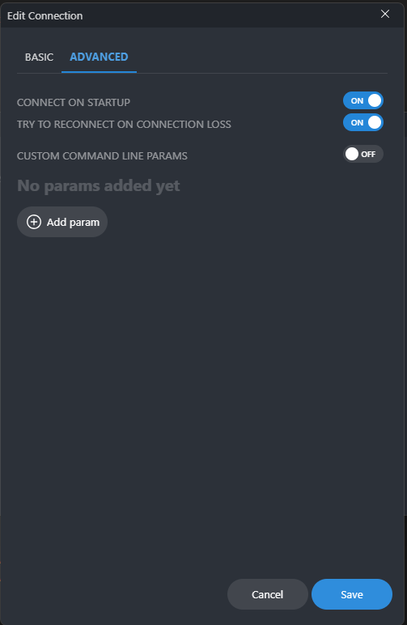

# File transfer tools

## FileZilla Client

Files transfers to/from PUB400 can be easily done with FileZilla Client. Download site: [FileZilla®, the free FTP solution](https://filezilla-project.org/).

There are several ways to run a transfer with FileZilla. I use two of them depending if I am dealing with IFS or QSYS.LIB files. Therefore, I have two remote sites in my setup.

The first one, which I use most of the times when dealing with IFS, is using sftp - SSH File Transfer Protocol and my private key to login.


Below is and xml export of the FileZilla client remote site configuration with sftp.

```xml
<Server>
    <Host>pub400.com</Host>
    <Port>2222</Port>
    <Protocol>1</Protocol>
    <Type>0</Type>
    <User>my_userprofile_on_PUB400</User>
    <Keyfile>the full path to ppk file</Keyfile>
    <Logontype>5</Logontype>
    <EncodingType>Custom</EncodingType>
    <CustomEncoding>CP-1252</CustomEncoding>
    <BypassProxy>0</BypassProxy>
    <Name>pub400</Name>
    <LocalDir>C:\Users\my_user_on_Windows\Downloads</LocalDir>
    <RemoteDir>1 0 4 home 7 my_userprofile_on_PUB400</RemoteDir>
    <SyncBrowsing>0</SyncBrowsing>
    <DirectoryComparison>0</DirectoryComparison>
</Server>
```

(check out [Using an ssh keys pair to login.md](Using%20an%20ssh%20keys%20pair%20to%20login.md) for more details on the way to create this ppk file)

The second one, which I use most of the times when dealing with QSYS, is using FTP File Transfer Protocol over TLS. As this connects to the ftp server on PUB400 in place of sftp server, it is more suitable to handle QSYS objects such as save files. In this last case, FileZilla allows entering anf ftp subcommand, such as "cwd /QSYS.LIB/DIMARCOB.LIB" to send a save file (i.e. with a .SAVF name extension) and get it created as a real save file.


Below is and xml export of the FileZilla client remote site configuration with FTP over TLS.

```xml
<Server>
    <Host>pub400.com</Host>
    <Port>21</Port>
    <Protocol>4</Protocol>
    <Type>0</Type>
    <User>my_userprofile_on_PUB400</User>
    <Logontype>2</Logontype>
    <PasvMode>MODE_DEFAULT</PasvMode>
    <EncodingType>Auto</EncodingType>
    <BypassProxy>0</BypassProxy>
    <Name>pub400_ftp</Name>
    <LocalDir>C:\Users\my_user_on_Windows\Downloads</LocalDir>
    <RemoteDir>1 0 4 home 7 my_userprofile_on_PUB400</RemoteDir>
    <SyncBrowsing>0</SyncBrowsing>
    <DirectoryComparison>0</DirectoryComparison>
</Server>
```

## SSHFS-Win

Despite this software is no longer updated, I use it to provide a file system access to PUB400's IFS through an encrypted connection which is sftp. This software provides the layer to emulate a file system access through sftp. All the settings are done with SSHFS-Win Manager.

Download site: [SSHFS-Win · SSHFS for Windows](https://github.com/winfsp/sshfs-win/blob/master/README.md).

## SSHFS-Win Manager

In conjunction with SSHFS-Win, SSHFS-Win Manager provides a graphical interface to set a file system access through sftp.

Download site: [SSHFS-Win Manager](https://github.com/evsar3/sshfs-win-manager).

It is quite simple to use as there are only two kinds of parameter to set:

Those related to the SSHFS-Win program:



- SSHFS BINARY: C:\Program Files\SSHFS-Win\bin\sshfs.exe
- PROCESS TIMEOUT: 15
- STARTUP WITH WINDOWS: ON
- DISPLAY SYSTEM TRAY MESSAGE ON CLOSE: ON
- SHOW DEBUG PANEL: OFF

Those related to the connection to the servers:



- BASIC/NAME: pub400
- BASIC/CONNECTION
  - IP/HOST: pub400.com
  - PORT: 2222
  - USER: my_userprofile_on_PUB400
  - AUTHENTICATION METHOD: Private key (file)
  - KEY FILE: the full path to openssh key file
- BASIC/REMOTE
  -PATH: /home/my_userprofile_on_PUB400
- BASIC/LOCAL
  - DRIVE LETTER: P:

(check out  for more details on the way to create this openssh key file)



- ADVANCED/CONNECT ON STARTUP: ON
- ADVANCED/TRY TO RECONNECT ON CONNECTION LOST: ON
- CUSTOM COMMAND LINE PARAMS: OFF

With both those two SSHFS-Win programs, the workstation has a permanent encrypted and transparent access to my home directory on PUB400. Example below:

```text
P:\>dir
 Le volume dans le lecteur P s’appelle pub400
 Le numéro de série du volume est 8F63-2FAB

 Répertoire de P:\

19/08/2023  13:19               240 .Xauthority
19/08/2023  16:20            11 291 .bash_history
28/07/2022  16:47               198 .bash_profile
09/03/2023  17:15                24 .bashrc
20/07/2023  22:11    <DIR>          .iSeriesAccess
20/07/2023  22:13                64 .isql_history
20/07/2023  22:11                 0 .odbc.ini
30/07/2022  11:16                42 .profile
10/11/2022  15:07                40 .python_history
07/06/2023  18:50               436 .sh_history
07/06/2023  18:43    <DIR>          .ssh
16/06/2023  11:20                44 .vi_history
19/08/2023  16:20    <DIR>          .vscode
27/07/2023  17:01    <DIR>          projects
19/08/2023  13:18    <DIR>          tmp
              10 fichier(s)           94 299 octets
               5 Rép(s)  481 482 366 976 octets libres
```
