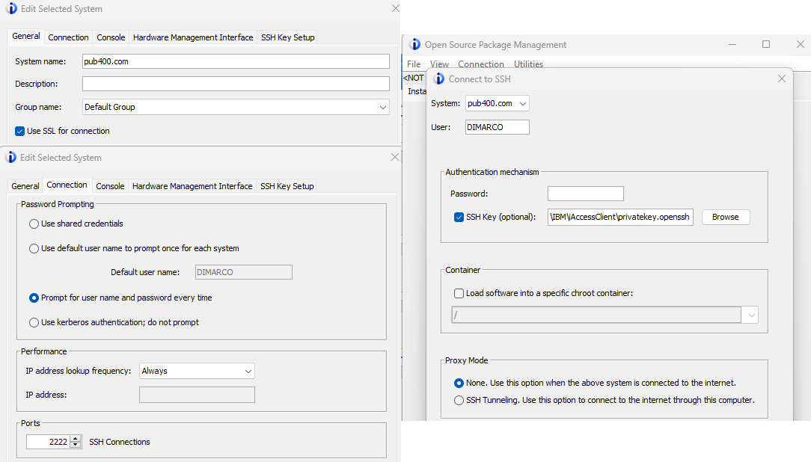

# IBM i specific tools

## IBM i Access Client Solution

This IBM software (iACS) provides essential tools to connect to an IBM i. The main modules I use with PUB400 are the 5250 Emulator, Database Schemas, Database Run SQL Scripts and in a lower way, Integrated File Systems, Printer Output. The license is linked to the server and PUB400 has an unlimited license. So we can install it without issue.

Download site: [IBM i Access - Client Solutions](https://www.ibm.com/support/pages/ibm-i-access-client-solutions); a free IBM Id is required at download time.
Normally there is an alternative which is to download it from PUB400's /QIBM/ProdData/Access/ACS/Base/ directory but the access is not allowed.

Main items setup:

- system name: pub400.com
- use SSL: Yes
- password prompting: Prompt for user profile and password every time
- IP address lookup frequency: always
- SSH Connections port: 2222
- SSH authentication mechanism for Open Source Package Management: SSH Key: the full path to openssh key file; unfortunately, we are not allowed to use this Open Source Package Management procedure on PUB400.
- SSH authentication mechanism for SSH Terminal: putty set as SSH client and the full path to ppk key file provided through acsconfig.properties file
  - com.ibm.iaccess.PreferredSSHClient=Putty
  - com.ibm.iaccess.SSHClientOpts=-i privatekey.ppk

(check out [Using an ssh keys pair to login.md](Using%20an%20ssh%20keys%20pair%20to%20login.md) for more details on the way to create those openssh and ppk key file)

## IBM i Navigator

IBM i Navigator is a web based interface to access administration tasks on an IBM i system. However, on PUB400, as normal users, we have only a couple of allowed features and cannot access most of those tasks.

To access IBM i Navigator, we hust have to point a browser to [PUB400 Navigator for i](https://pub400.com:2003/Navigator/login) and log in with our regular user profile/password.
