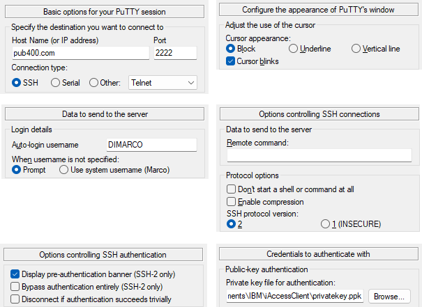

# ssh based tools

ssh based tools allow a better usage of open source based utilities than using QSH or QP2TERM from a 5250 session.

## putty, an ssh client on Windows

When dealing with IFS files, it is often easy to use an ssh client. There is one which is provided by Microsoft and comes with recent versions of Windows. However, I have always use putty.

Download site: .

I have one pub400 saved session in putty configuration. The parameters are as follow, other parameters keeping their default value.



- Session
  - Host Name: pub400.com
  - Port: 2222
  - Connection Type: SSH
- Window/Appareance
  - Cursor Appareance: Block
  - Cursor Blinks: selected
- Connection/Data
  - Auto-login username: my_userprofile_on_PUB400
- Connection/SSH
  - SSH protocol version: 2 selected
- Connection/SSH/Auth
  - Display pre-authentication banner: selected
- Connection/SSH/Auth/Credentials
  - Private key file for authentication: the full path to ppk file (check out  for more details on the way to create this ppk file)

  In order to use any ssh connection to PUB400, the known_hosts file used by putty must be updated the first time such a connection is requested. Once done, the content of C:\Users\my_user_on_Windows\.ssh\known_hosts is similar to below:

```text
[pub400.com]:2222 ssh-ed25519 somekeyusedbypub400toensureitisreallypub400
```

Note that when creating my private/public keys pair, I have selected the highest type of key (EdDSA) with a 255 bits size, which is a type of key that the ssh daemon on PUB400 agrees to handle.
