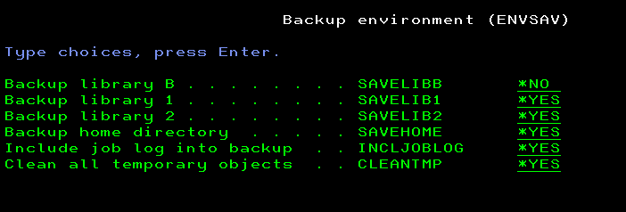
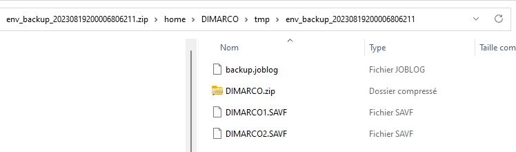

# Environment save

This tool provides a way to save the personal environment on PUB400.com. It was initiated after a [question on PUB400's chatbox](https://pub400.com/mbr/forum.nd/chatbox) where BADETI was asking on 26th of July 2023 this question "Hi, Is there any body help me how to restore the QCPPSRC file into my lib.I deleted that from my lib unfortunately .". It happens that libraries and IFS are saved to tape on a regular basis but we have no way to initiate a restore ourself.
The tool is based on the standard setup on PUB400.com with three libraries, named with 1, 2, B suffix added to the user profile and an IFS home directory named with the user profile in */home* directory.

More information about the way to [install the tool here](installation.md).

## Save on PUB400.com

This action is done with *ENVSAV* command. The description of each parameter is the following:

|Parameter|Description|Choices|Notes|
|---------|-----------|-------|-----|
|SAVELIBB|Backup library B|*YES, __*NO__|Optional, default *NO|
|SAVELIB1|Backup library 1|__*YES__, *NO|Optional, default *YES|
|SAVELIB2|Backup library 2|__*YES__, *NO|Optional, default *YES|
|SAVEHOME|Backup home directory|__*YES__, *NO|Optional, default *YES|
|INCLJOBLOG|Include job log into backup|__*YES__, *NO|Optional, default *YES|
|CLEANTMP|Clean all temporary objects|__*YES__, *NO|Optional, default *YES|
|EXCLUDETMP|Exclude HOME/tmp subdirectory|__*YES__, \*NO|Optional, default \*YES, prompted with SAVEHOME(\*YES)|



Recommended invokation for a regular usage is to keep the default, so either *ENVSAV* or *ENVSAV SAVELIBB(\*NO) SAVELIB1(\*YES) SAVELIB2(\*YES) SAVEHOME(\*YES) INCLJOBLOG(\*YES) CLEANTMP(\*YES) EXCLUDETMP(\*YES)* are both suitable.
If it is needed to only clean the temporary objects, use *ENVSAV SAVELIBB(\*NO) SAVELIB1(\*NO) SAVELIB2(\*NO) SAVEHOME(\*NO) INCLJOBLOG(\*NO) CLEANTMP(\*YES)*.

### Validity checker actions

The validity checker does nothing else than the standard. For more information about this standard, checkout "ILE CL command validity checker programs" in [Programming rules and conventions](../../Common/Programming%20rules%20and%20conventions.md).

### Behavior of the command

The command processing program (CPP) makes use of two temporary subdirectories in HOME directory and of the B library to store files and objects. Those subdirectories are named:

- *env_backup_YYYYYYMMDDHHMMSSssssss* in HOME/tmp subdirectory to retain a copy of each save files, this is the "temporary" subdirectory
- *forws* in HOME directory to retain the final file to keep until next invokation, this is the "backup" subdirectory

If at least one backup is requested, it produces a zip file with the name of the temporary subdirectory (and .zip suffix) in the backup subdirectory. In this zip file there is one save file for each requested backup (see below for the name of those files) and, if including job log is requested, a text file named *backup.joblog*.
Note: the full path to the files is included in the zip file.

Users have limited allowed storage. Therefore, the CPP takes care as much as possible of temporary objects and delete them as soon as they are no longer needed. However, in case an unexpected error occurs, those temporary objects might still exist. This is the reason of the CLEANTMP parameter.

Basically, the CPP performs the following tasks:

1. check the proper number of parameters in case the program is not called through command interface; CPX6148 *ESCAPE message is sent to itself in order to activate the standard error handling routine
2. call the validity checker program in case the program is not called through command interface
3. create *tmp* subdirectory in HOME directory if it does not exist
4. set the variables related to the standard error handling routine in case of an unexpected error: CPDA4A8 message is used in this case
5. if clean all temporary objects is requested
   - delete all save files in B library which were remaining from a previous command invokations
   - delete backup subdirectory which was remaining from a previous command invokations
   - delete temporary directories which were remaining from a previous command invokations
6. if at least one backup is requested, create the temporary subdirectory of HOME/tmp
7. if B library backup is requested
   - create or clear a save file in B library with the name of B library
   - save B library to this save file with *ZLIB compression (excluding the save file itself)
   - copy the save file into the temporary subdirectory
   - delete the save file
8. if 1 library backup is requested
   - create or clear a save file in B library with the name of 1 library
   - save 1 library to this save file with *ZLIB compression
   - copy the save file into the temporary subdirectory
   - delete the save file
9. if 2 library backup is requested
   - create or clear a save file in B library with the name of 2 library
   - save 2 library to this save file with *ZLIB compression
   - copy the save file into the temporary subdirectory
   - delete the save file
10. if HOME directory backup is requested, the content of the user home directory is "zipped" into a zip file in /tmp directory using zip Open Source package; the reason to proceed this way is that we do not have any way to restore IFS files from a save file on PUB400, as RST command is not allowed
    - if HOME/tmp exclusion is requested
      - add exclusion to QShell command
    - through a QShell invokation, zip the content of HOME directory
    - move the zip file to the temporary subdirectory
11. if at least one backup is requested
    - if including joblog is requested, using a QSH system command, output the joblog to a file named *backup.joblog* in the temporary subdirectory
    - copy and compress the content of the temporary subdirectory in a zip file in the backup directory, ready for download or restore process (note: this action is not included in the joblog)

An example of the content of the final zip file is below.



An example of the content of a successfull job log is in this [file](../Assets/envsav_successfull_joblog_example.txt).

### Sources files used

|File|Object|Object type|Object attribute|Description|
|----|------|-----------|----------------|-----------|
|envsav.cmd|ENVSAV|*CMD||Save environment command|
|envsav.pgm.clle|ENVSAV|*PGM|CLLE|Save environment command processing program|
|envsav0.pgm.clle|ENVSAV0|*PGM|CLLE|Save environment command validity checker|

## Automation from the workstation

The way which was selected in order to automate the backup process __and at the same time__ move the backup media out of PUB400 (if it was remaining on PUB400, we cannot say for sure that this is a proper backup...) was to initiate *ENVSAV* command using an ssh session, then to download the output zip file it produces to the workstation using an scp session. This way, it becomes possible to create a script (a PowerShell script in our case), and to configure a new scheduled task in Windows scheduler which calls this script.
This envsav.ps1 PowerShell script, which runs on the workstation, does the following tasks:

1. Check that all required parameters are provided
   1. Pub400UserProfile:  this is the name of the user profile which is used to login through ssh and for which the environment is saved
   2. sshKey: this is the full path of private ssh key used to login
   3. DownloadDirectory: this is the full path of directory where the output zip file is downloaded into
   4. ToKeep: number of files to keep in the download directory
2. Initiate environment backup on PUB400
   - run *ENVSAV* command through ssh
3. Initiate output zip file download to the workstation
   - download all *.zip files from backup directory into download directory through scp
4. Initiate cleanup of temporary objects used by environement backup on PUB400
   - run *ENVSAV SAVELIBB(\*NO) SAVELIB1(\*NO) SAVELIB2(\*NO) SAVEHOME(\*NO) INCLJOBLOG(\*NO) CLEANTMP(\*YES)* command through ssh
5. Perform cleanup of downloaded files
   - we keep only the count of more recent files which is provided as parameter
   - if that count is lower or equal than the parameter, no file is deleted

Typical usage of the script is below provided that the Windows command session starts in the directory where envsav.ps1 script resides:

```PowerShell
pwsh envsav.ps1 -Pub400UserProfile MYUSER -sshKey "privatekey.ppk" -DownloadDirectory "DownloadDirectoryPath" -ToKeep 7
```

This script is very basic and, more specifically, does not provide any error handling except for the number of parameters. Therefore, it is a good practice to review from time to time the content of the download directory to make sure it works as expected.

Now that the script is available it becomes easy to create an entry in Windows scheduler to automate running it and accomodates the backup strategy of users. My setup is to run it every day at 22:00, if my workstation is connected to a network (so that ssh sessions are possible) and to keep 7 versions of backup files.

## How to restore something

There is no automation here as, hopefully, it is not expected to often apply.
The process is not the same whether the restore operation applies to an object of the three libraries or files or directories of the HOME directory.

For objects:

1. Extract the desired save file from the desired output zip file
2. Send it to PUB400
   - use ftp (or better ftps with FileZilla) to transfer it directly in the target library (suggestion is to use the B library as a recipient of the save file) as provided by PUB400 [To transfer a save file to PUB400 from your PC](https://pub400.com/cgi/faqs.nd/go?yCURCAT=3&yCURFAQ=10)
     - note that the procedure above __does not work when using sftp__
   - copy it by any way (sftp, scp, iACS, Windows Explorer if a mapped disk exists...) into an IFS directory then use *CPY TOOBJ(thesavefilenameinIFSformatwithaFILEextension) TOCCSID(\*CALC)* command; there is no need to create the save file first and TOCCSID(*CALC) is mandatory for the copy to work
3. Once the save file is in the target library, checkout its content with *DSPSAVF* command to make sure it is using the proper format
4. Use the procedure provided on PUB400, [how to restore from a save file](https://pub400.com/cgi/faqs.nd/go?yCURCAT=3&yCURFAQ=8).

For IFS:

1. Extract the zip file from the desired output zip file
2. Use any of file transfer tools to recover the files/directory which are needed
   - important notice: as opposite to a regular SAV then RST operation, all files attributes (such as ownership, authorities, CCSID...) are lost
