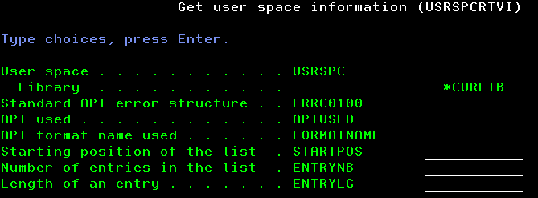
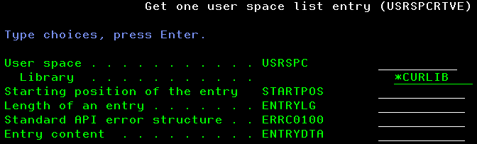

# User spaces Management

This set of tools provides ways to handle user spaces content from a program. It gets some inspiration from the famous TAATOOL suite of utilities, and more specifically, the [user spaces category](https://www.taatool.com/document/C_usrspc.html). These tools are intended to help managing the content of a user space filled up with the output of List APIs, such as QUSLJOB.
There is no SQL IBM i service in place in this set of tools. This is intended as only APIs were expected to be used.

Two kinds of tools are expected in this topic.

The first one provides functions within an RPGLE service program, named USRSPC to create a user space, retrieve its information and attributes and retrieve its entries. They are intended to be used from a program. Let's start to name those functions:

1. UserSpaceCrt() to create a user space
2. UserSpaceRtvInf() to retrieve the information of a user space
3. UserSpaceRtvEnt() to retrieve the content of an entry of a user space

RetrieveInfo and RetrieveEntry procedures work together. It is expected to use one with the other. Typically, a program will call the RetrieveInfo procedure and use the returned value to call the RetrieveEntry procedure.

The second one provides CL commands to fulfill the same objectives. They are intended to be used from a CL(LE) program. They are using the functions as described above. Let's name those commands.

1. USRSPCCRT to create a user space
2. USRSPCRTVI to retrieve the information and attributes of a user space
3. USRSPCRTVE to retrieve an entry of a user space

USRSPCRTVI and USRSPCRTVE commands work together. It is expected to use one with the other. Typically, a program will run the USRSPCRTVI command then use the returned value to run the USRSPCRTVE command.

More information about the way to [install the tool here](installation.md).

## USRSPC service program

The service program contains the procedures related to user spaces management which are available for use by ILE programs. Programs will address them through USRSPCAPI binding directory.

### UserSpaceCrt procedure

Input parameters are the following :

1. User space name
2. User space library
3. User space attribute
4. User space description text

Output parameter is the following :

1. Standard API error structure [ERRC0100](https://www.ibm.com/docs/en/i/7.5.0?topic=parameter-error-code-format#errorcodeformat__title__2)

The procedure makes use of [QUSCRTUS](https://www.ibm.com/docs/en/i/7.5.0?topic=ssw_ibm_i_75/apis/quscrtus.html) API.
Some of the parameters are forced as shown below :

- Initial size at 2000 bytes
- Initial content as blank
- Public authority as *LIBCRTAUT
- Automatic replacement as *YES
- Object domain as *DEFAULT
- Transfer size request as 0
- Optimum alignment as 1
- Automatic extendibility as 1

Other API parameters come from procedure parameters.

Error structure Bytes Provided value is set to 116 in order to optimize the content of ERRC0100 parameter. In case of an error, Exception Id and Exception data will contain:

- any value provided back by the API.

#### UserSpaceCrt() typical usage in RPGLE programs

Special control option to set:

- bnddir('USRSPCAPI')

Sources files to include:

- inc_basic_declare.rpgle
- inc_stdapi_declare.rpgle
- inc_usrspc_declare.rpgle

Invocation followed by ERRC0100 content handling to detect any error:

```RPGLE
ERRC0100 = UserSpaceCrt(UserSpace:Library:Attribute:Text);
if ExceptId <> Blank;
    dosomething;
else;
    dosomething;
endif;

```

#### UserSpaceCrt() typical usage in CLLE programs

Special processing option to declare:

- BNDDIR(USRSPCAPI)

Source files to include:

- inc_stdapi_declare.clle

Invocation (notice to code the procedure name in upper case) followed by ERRC0100 content handling to detect any error:

```CLLE
CALLPRC PRC('USERSPACECRT') PARM(&USRSPC &USRSPCLIB &USRSPCATT &USRSPCTEXT) RTNVAL(&ERRC0100)
IF COND(&EXCEPTID *NE &BLANK) THEN( dosomething)
ELSE CMD(dosomethingelse)
```

### UserSpaceRtvInf procedure

Input parameters are the following :

1. User space name
2. User space library

Output parameters are the following :

1. Standard API error structure [ERRC0100](https://www.ibm.com/docs/en/i/7.5.0?topic=parameter-error-code-format#errorcodeformat__title__2)
2. Name of the API used to populate the user space
3. Format of the API used to populate the user space
4. Starting position of the list provided by the API in the user space
5. Number of entries of the list
6. Size of an entry

The procedure makes use of [QUSRTVUS](https://www.ibm.com/docs/en/i/7.5.0?topic=ssw_ibm_i_75/apis/qusrtvus.html) API.

Error structure Bytes Provided value is set to 116 in order to optimize the content of ERRC0100 parameter. In case of an error, Exception Id and Exception data will contain:

- any value provided back by the API
- USP0201 message id from TOOMSGF message file and related data if the API used is not valid
- USP0202 message id from TOOMSGF message file and related data if the format name is not valid
- USP0203 message id from TOOMSGF message file and related data if unexpected value is found in one of the numeric fields

#### UserSpaceRtvInf() typical usage in RPGLE programs

Special control option to set:

- bnddir('USRSPCAPI')

Sources files to include:

- inc_basic_declare.rpgle
- inc_stdapi_declare.rpgle
- inc_usrspc_declare.rpgle

Invocation followed by ERRC0100 content handling to detect any error:

```RPGLE
UserSpaceRtvInf(UserSpace:Library:ERRC0100:APIUsed:FormatName:StartingPosition:EntryNumber:EntryLength);
if ExceptId <> Blank;
    dosomething;
else;
    dosomething;
endif;

```

#### UserSpaceRtvInf() typical usage in CLLE programs

Special processing option to declare:

- BNDDIR(USRSPCAPI)

Source files to include:

- inc_stdapi_declare.clle

Invocation (notice to code the procedure name in upper case) followed by ERRC0100 content handling to detect any error:

```CLLE
CALLPRC PRC('USERSPACERTVINF') PARM(&USRSPC &USRSPCLIB &ERRC0100 &APIUSED &FORMATNAME &STARTPOS &ENTRYNB &ENTRYLG)
IF COND(&EXCEPTID *NE &BLANK) THEN( dosomething)
ELSE CMD(dosomethingelse)
```

### UserSpaceRtvEnt procedure

Input parameters are the following :

1. User space name
2. User space library
3. Starting position in the list in the user space
4. Size of an entry

Output parameters are the following :

1. Standard API error structure [ERRC0100](https://www.ibm.com/docs/en/i/7.5.0?topic=parameter-error-code-format#errorcodeformat__title__2)
2. Entry content

The procedure makes use of [QUSRTVUS](https://www.ibm.com/docs/en/i/7.5.0?topic=ssw_ibm_i_75/apis/qusrtvus.html) API.

Error structure Bytes Provided value is set to 116 in order to optimize the content of ERRC0100 parameter. In case of an error, Exception Id and Exception data will contain:

- any value provided back by the API

#### UserSpaceRtvEnt() typical usage in RPGLE programs

Special control option to set:

- bnddir('USRSPCAPI')

Sources files to include:

- inc_basic_declare.rpgle
- inc_stdapi_declare.rpgle
- inc_usrspc_declare.rpgle

Invocation followed by ERRC0100 content handling to detect any error:

```RPGLE
UserSpaceRtvEnt(UserSpace:Library:StartingPosition:EntryLength:ERRC0100:EntryData);
if ExceptId <> Blank;
    dosomething;
else;
    dosomething;
endif;

```

#### UserSpaceRtvEnt() typical usage in CLLE programs

Special processing option to declare:

- BNDDIR(USRSPCAPI)

Source files to include:

- inc_stdapi_declare.clle

Invocation (notice to code the procedure name in upper case) followed by ERRC0100 content handling to detect any error:

```CLLE
DOFOR VAR(&I) FROM(1) TO(&ENTRYNB)
    CHGVAR VAR(&STARTPOS) VALUE(&STARTPOS + (&I - 1) * &ENTRYLG)
    CALLPRC PRC('USERSPACERTVENT') PARM(&USRSPC &USRSPCLIB &STARTPOS &ENTRYLG &ERRC0100 &ENTRYDTA)
    IF COND(&EXCEPTID *NE &BLANK) THEN( dosomething)
    ELSE CMD(dosomethingelse)
ENDDO
```

## User space creation command

This action is done with USRSPCCRT command. The description of each parameter is the following:

|Parameter|Description|Choices|Notes|
|---------|-----------|-------|-----|
|USRSPC|User space and user space library||Mandatory, must be valid names, special value \*CURLIB for the library|
|ATTRIBUTE|User space attribute||Mandatory, must be a valid name|
|TEXT|Object description||Optional|


### USRSPCCRT command Validity checker actions

The validity checker redoes all the checks which are done by command interface. It will never detect any issue when it is called by the command interface, but it might detect an issue in case the command processing program is directly used without the command interface. For more information about the standard for a validity checker program, checkout "ILE CL error routine within validity checker programs" in [Programming rules and conventions](../../Common/Programming%20rules%20and%20conventions.md).

Basically this program performs the following actions:

1. if USRSPC is not a valid name, set the error parameter status to TRUE and send CPD0071 \*DIAG message to caller program
2. if user space library is not \*CURLIB and not a valid name, set the error parameter status to TRUE and send CPD0071 \*DIAG message to caller program
3. if ATTRIBUTE is not a valid name, set the error parameter status to TRUE and send CPD0084 \*DIAG message to caller program
4. if there is at least one error, send CPF0002 \*ESCAPE message to caller program

In order to detect name validity, the program does the following. It tries to check the existence of a user profile object in QTEMP library with the value to check as the user profile name. There will never be a user profile outside of QSYS library. Therefore, if the name is valid, the program will detect a CPF9801 exception, and if the name is not valid, it will detect a CPD0078 diagnostic.

### Behavior of USRSPCCRT command

The command processing program (CPP) is quite simple. It invokes the UserSpaceCrt procedure, then check the return code value. If there is no error, it sends back a USP0101 completion message from TOOMSGF message file. If there is an error, the exception id found in API error structure is sent back as an exception message.

#### Exception messages sent by USRSPCCRT command

- any message provided back by the API

## User space information retrieval command

This action is done with USRSPCRTVI command. This command __must__ be used in a CL (or REXX) program in order to receive the valuess into variables (i.e. it cannot be used outside of a program). The description of each parameter is the following:

|Parameter|Description|Choices|Notes|
|---------|-----------|-------|-----|
|USRSPC|User space and user space library||Mandatory, must be valid names, special value \*CURLIB or \*LIBL for the library|
|ERRC0100|CL variable for error structure||Mandatory, must be a 3024 characters variable value|
|APIUSED|CL variable for API used||Mandatory, must be a 10 characters variable value|
|FORMATNAME|CL variable for format name||Mandatory, must be a 8 characters variable value|
|STARTPOS|CL variable for list starting position||Mandatory, must be a 4 unsigned integer variable value|
|ENTRYNB|CL variable for entries number||Mandatory, must be a 4 unsigned integer variable value|
|ENTRYLG|CL variable for entry length||Mandatory, must be a 4 unsigned integer variable value|



### USRSPCRTVI command Validity checker actions

The validity checker redoes all the checks which are done by command interface. It will never detect any issue when it is called by the command interface, but it might detect an issue in case the command processing program is directly used without the command interface. For more information about the standard for a validity checker program, checkout "ILE CL error routine within validity checker programs" in [Programming rules and conventions](../../Common/Programming%20rules%20and%20conventions.md).

Basically this program performs the following actions:

1. if USRSPC is not a valid name, set the error parameter status to TRUE and send CPD0071 \*DIAG message to caller program
2. if user space library is not \*LIBL, \*CURLIB and not a valid name, set the error parameter status to TRUE and send CPD0071 \*DIAG message to caller program

Notice that we do not check anything in relation to the parameters expected to be a variable, because the command does not send any value for those parameters. Therefore, there is no way to determine if the command processing program was properly called through using the command, or was directly called without using the command.

In order to detect name validity, the program does the following. It tries to check the existence of a user profile object in QTEMP library with the value to check as the user profile name. There will never be a user profile outside of QSYS library. Therefore, if the name is valid, the program will detect a CPF9801 exception, and if the name is not valid, it will detect a CPD0078 diagnostic.

### Behavior of USRSPCRTVI command

The command processing program (CPP) is quite simple. It invokes the UserSpaceInf procedure, then check the return code value. If there is no error, the variables provided as parameters contain the expected value, ready to be used by the calling program. If there is an error, the exception id found in API error structure is sent back as an exception message. See [User Space retrieve information procedure](#userspacertvinf-procedure) for more details on the possible errors. In particular, it expects messages ids only from QCPFMSG and TOOMSGF (and USPxxxx message ids in this case) message files.

A strange behavior was detected during development, when calling the UserSpaceRtvInf procedure with the same variables as those received as parameters. If we use the normal way, which is to use the command, everything runs fine. However, if we call the command processing program directly, the parameters receive unexpected value. This is the reason why, intermediate variables (&VARx) were used and their content was tested to detect more errors.

#### Exception messages sent by USRSPCRTVI command

- any message provided back by the API
- USP0201 message id from TOOMSGF message file and related data if the API used is not valid
- USP0202 message id from TOOMSGF message file and related data if the format name is not valid
- USP0203 message id from TOOMSGF message file and related data if unexpected value is found in one of the numeric fields
- USP0211 message id from TOOMSGF message file and related data if any unexpected value is detected from the user space

### Source files used in USRSPCRTVI command

|File|Object|Object type|Object attribute|Description|
|----|------|-----------|----------------|-----------|
|usrspcrtvi.cmd|USRSPCRTVI|*CMD||Get user space information|
|usrspcrtvi.pgm.clle|USRSPCRTVI|*PGM|CLLE|Get user space information command processing program|
|usrspccrti0.pgm.clle|USRSPCRTI0|*PGM|CLLE|Get user space information command validity checker|

## User space list entry retrieval command

This action is done with USRSPCRTVE command. This command __must__ be used in a CL (or REXX) program in order to receive the valuess into variables (i.e. it cannot be used outside of a program). The description of each parameter is the following:

|Parameter|Description|Choices|Notes|
|---------|-----------|-------|-----|
|USRSPC|User space and user space library||Mandatory, must be valid names, special value \*CURLIB or \*LIBL for the library|
|STARTPOS|List starting position||Mandatory, must be a 4 unsigned integer value|
|ENTRYLG|Entry length||Mandatory, must be a 4 unsigned integer value|
|ERRC0100|CL variable for error structure||Mandatory, must be a 3024 characters variable value|
|ENTRYDTA|CL variable for entry data||Mandatory, must be a 2000 characters variable value|



### USRSPCRTVE command Validity checker actions

The validity checker redoes all the checks which are done by command interface. It will never detect any issue when it is called by the command interface, but it might detect an issue in case the command processing program is directly used without the command interface. For more information about the standard for a validity checker program, checkout "ILE CL error routine within validity checker programs" in [Programming rules and conventions](../../Common/Programming%20rules%20and%20conventions.md).

Basically this program performs the following actions:

1. if USRSPC is not a valid name, set the error parameter status to TRUE and send CPD0071 \*DIAG message to caller program
2. if user space library is not \*LIBL, \*CURLIB and not a valid name, set the error parameter status to TRUE and send CPD0071 \*DIAG message to caller program

Notice that we do not check anything in relation to the parameters expected to be a variable, because the command does not send any value for those parameters. Therefore, there is no way to determine if the command processing program was properly called through using the command, or was directly called without using the command.

In order to detect name validity, the program does the following. It tries to check the existence of a user profile object in QTEMP library with the value to check as the user profile name. There will never be a user profile outside of QSYS library. Therefore, if the name is valid, the program will detect a CPF9801 exception, and if the name is not valid, it will detect a CPD0078 diagnostic.

### Behavior of USRSPCRTVE command

The command processing program (CPP) is quite simple. It invokes the UserSpaceEnt procedure, then check the return code value. If there is no error, the variables provided as parameters contain the expected value, ready to be used by the calling program. If there is an error, the exception id found in API error structure is sent back as an exception message. See [User Space retrieve information procedure](#userspacertvinf-procedure) for more details on the possible errors. In particular, it expects messages ids only from QCPFMSG and TOOMSGF (and USPxxxx message ids in this case) message files.

A strange behavior was detected during development, when calling the UserSpaceRtvInf procedure with the same variables as those received as parameters. If we use the normal way, which is to use the command, everything runs fine. However, if we call the command processing program directly, the parameters receive unexpected value. This is the reason why, intermediate variables (&VARx) were used and their content was tested to detect more errors.

#### Exception messages sent by USRSPCRTVE command

- any message provided back by the API
- USP0212 message id from TOOMSGF message file and related data if any unexpected value is detected from the user space

### Source files used in USRSPCRTVE command

|File|Object|Object type|Object attribute|Description|
|----|------|-----------|----------------|-----------|
|usrspcrtve.cmd|USRSPCRTVE|*CMD||Get one user space list entry|
|usrspcrtve.pgm.clle|USRSPCRTVE|*PGM|CLLE|Get one user space list entry command processing program|
|usrspccrte0.pgm.clle|USRSPCRTE0|*PGM|CLLE|Get one user space list entry command validity checker|
