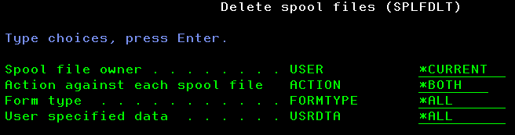

# Delete a bunch of spool files

There are much more ways to achieve the same results (with DLTSPLF command for instance), but this is a demonstration of using USRSPCCRT, USRSPCRTVI and USRSPCRTVE commands.

This action is done with SPLFDLT command. The description of each parameter is the following:

|Parameter|Description|Choices|Notes|
|---------|-----------|-------|-----|
|USER|Spool files owner||Must be valid names, special value \*CURRENT for current user profile|
|ACTION|Action against each spool file|\*BOTH, \*DLTONLY, \*LOGONLY|\*BOTH is the default|
|FORMTYPE|Form type|a 10 characters string, \*ALL, \*STD|\*ALL is the default|
|USRDTA|User specified data|a 10 characters string, \*ALL|\*ALL is the default|

## SPLFDLT command Validity checker actions

The validity checker does nothing else than the standard. For more information about this standard, checkout "ILE CL command validity checker programs" in [Programming rules and conventions](../../Common/Programming%20rules%20and%20conventions.md).

## Behavior of SPLFDLT command

The command processing program (CPP) sends back to the calling program any exception received when running User Space commands.
The CPP performs the following tasks (not included here those which are standard for calling the validity checker program and initializing variables).

1. Create a user space in QTEMP library with SPLFxxxxxx name and xxxxxx is the job number
2. Call QUSLSPL API to fill the user space
3. Retrieve user space information
4. Browse all entries list from the user space
    - counter of non deleted spool files is updated accordingly to the spool files deletion command
    - counter of deleted spool files is updated accordingly to the spool files deletion command or entry retrieval depending on ACTION parameter
    - if ACTION parameter is *LOGONLY
        - send USP0301 message if from TOOMSGF as an information message to the job log with spool file identifiers
    - if ACTION parameter is *DLTONLY
        - delete spool file
        - if deletion is not successful
            - send USP0312 from TOOMSGF as a diagnostic message to the log log with spool file identifiers
    - if ACTION parameter is *BOTH
        - delete spool file
        - if deletion is successful
            - send USP0302 from TOOMSGF as an information message to the job log with spool file identifiers
        - if deletion is not successful
            - send USP0312 from TOOMSGF as a diagnostic message to the log log with spool file identifiers
5. When done
    - if no error found, send a completion message with the count of either eligible or deleted spool files
        - if ACTION parameter
            - was *LOGONLY, message id is USP0303 from TOOMSGF
            - otherwise, message id is USP0304 from TOOMSGF
    - at least one error was found, send a USP0311 from TOOMSGF as an escape message

## Exception messages sent by SPLFDLT command

- any message provided back by the API
- USP0311 message id from TOOMSGF message file and count of deleted and non deleted spool files

## Possible improvements

A possible improvement is to allow more criteria to select more spool files, according to QUSLSPL API capabilities.

- *ALL could be added as a special value for USER parameter
- add a parameter to select output queues
