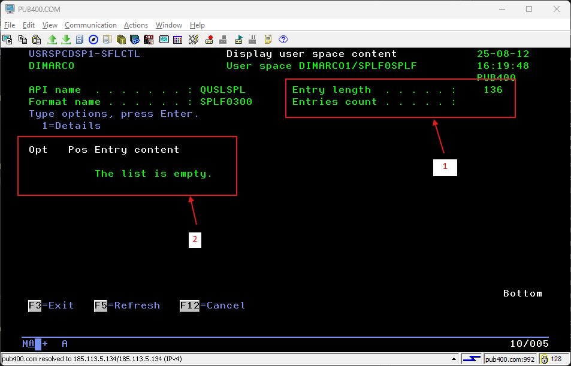

# Display the content of a user space

This action is achieved with using USRSPCDSP command. The descripton of each parameter is the following:

|Parameter|Description|Choices|Notes|
|---------|-----------|-------|-----|
|USRSPC|User space and user space library||Mandatory, must be valid names, special values \*CURLIB and \*LIBL for the library|

## Command validity checker actions

The validity checker redoes all the checks which are done by command interface. It will never detect any issue when it is called by the command interface, but it might detect an issue in case the command processing program is directly used without the command interface. For more information about the standard for a validity checker program, checkout "ILE CL error routine within validity checker programs" in [Programming rules and conventions](../../Common/Programming%20rules%20and%20conventions.md).

Basically this program performs the following actions:

1. if USRSPC is not a valid name, set the error parameter status to TRUE and send CPD0071 \*DIAG message to caller program
2. if user space library is neither \*CURLIB, nor \*LIBL, and nor a valid name, set the error parameter status to TRUE and send CPD0084 \*DIAG message to caller program
3. if ATTRIBUTE is not a valid name, set the error parameter status to TRUE and send CPD0084 \*DIAG message to caller program
4. if there is at least one error, send CPF0002 \*ESCAPE message to caller program

In order to detect name validity, the program does the following. It tries to check the existence of a user profile object in QTEMP library with the value to check as the user profile name. There will never be a user profile outside of QSYS library. Therefore, if the name is valid, the program will detect a CPF9801 exception, and if the name is not valid, it will detect a CPD0078 diagnostic.

## Behavior of the command

The command processing program (CPP) is quite simple. It only retrieves the library of the user space (in order to override \*LIBL and \*CURLIB special values with the real library). Then it gives all control to USRSPCDSP1 program.

This RPGLE program is more complex.

It includes the following local subprocedures:

- Main; this is the program entry subprocedure
- ClearSubFile; responsible for clearing the subfile
- LoadSubFile; responsible for loading the subfile from the user space
- RefreshSubFile; responsible for refreshing the subfile content when requested
- HandleSubFile; responsible for main display format handling
- ReadSubFile; responsible for reading the content of the subfile
- SelectFormat; responsible for displaying the format with properly populated fields according to API/Format used to fill up the user space
- SPLF0300Proc; responsible for populating subfile row field for QUSLSPL API and SPLF0300 format
- PrepareDETAIL01; responsible for populating display format fields used to detail QUSLSPL/SPLF0300 API/format
- ReturnProc; used to properly end the program
- InvokeDSPF; handle special display format when there is an unexpected API/Format in the user space

### Programming general considerations

The behavior of F3 exit key is to get out of the program whatever the display file format.
The behavior of F12 cancel key is to cancel the actual action and go back to the previous display file format.

The subfile is fully loaded, as opposite to loading pages on request. Therefore, there is the limit of 9999 records for the subfile. In case the user space entry list retains more entries, only the first 9999 entries are loaded.

The display file makes use of INDARA keyword, so that indicators are used through self-explaining variables. The following exceptions exist:

- IN90: used to condition the normal detailed display or a specific error on DETAIL01 display format

At initial developing time, only one API/Format output is supported. In case support for others would be required, the way to proceed is described in "Possible improvements" section of thids document.

### Main procedure

It performs the following actions:

1. Retrieve user space information to gather API, Format, Entries count, Entry length, First entry position
2. In case of any error, invoke ReturnProc procedure then get out of the program
3. Open the display file
4. Check the API/Format coming from the user space
5. In case of unexpected API or Format, invoke InvokeDSPF procedure then get out of the program
6. Invoke HandleSubFile procedure to start displaying the user space content
7. Invoke ReturnProc procedure then get out of the program

### ClearSubFile procedure

It performs the following actions:

1. Set SFLDSP and SFLDSPCTL indicators to *off
2. Clear subfile
3. Set SFLDSP and SFLDSPCTL indicators to *on; whatever the content of the user space, the subfile will always get displayed, with two special rows in case, the user space list is empty

### LoadSubFile procedure

It performs the following actions:

1. Browse the user space based on Entries count, Entry length, First entry position
2. For each entry
    1. In case of error when retrieving the entry content, fill the subfile row with the API ExceptionId and ExceptionData
    2. If no error, invoke the appropriate subprocedure to fill the subfile row; SPLF0300Proc is the only one at this time
    3. If the entry data is longer than the size of the subile row, notify it with "..." written at the end of the row
3. Set the subfile RelativeRecordNumber to 1 so that the first page is displayed

### RefreshSubFile procedure

It performs the following actions:

1. Invoke ClearSubFile procedure to clear the subfile
2. If the entry list is not empty, invoke LoadSubfile procedure to load the subfile
3. If the entry list is empty, write an empty row, then a second row notifying that the list is empty; notice the usage of DSPATR($ATTRIBUTE) keyword in the display file, so that selection and position fields are protected and non displayed in the subfile; review the documentation for [more information](https://www.ibm.com/docs/en/i/7.5.0?topic=80-dspatr-display-attribute-keyword-display-files) about using a variable with DSPATR keyword

### HandleSubFile procedure

It performs the following actions:

1. Invoke RefreshSubFile procedure to properly load the subfile
2. Until F3 or F12 key is entered
    1. display the user space content
    2. if F3 or F12 key is entered, leave the procedure
    3. if F5 key is entered, refresh the subfile
    4. otherwise, and when the list is not empty, invoke ReadSubFile procedure to discover any selection in the subfile, and therefore display the detail of an entry
    5. simulate hitting F3 key if it was hitted when displaying the detail format

### ReadSubFile procedure

It performs the following actions:

1. Read subfile changed record
2. While there is one changed record
    1. If expected selection was entered, invoke SelectFormat procedure to finally display the format with detailed data
    2. Update the subfile record to remove any entered value
    3. Continue to read the next changed record if Enter key was hitted on the detailed display format
3. Send back the hitted key within display detail format and return to calling procedure

### SelectFormat procedure

It performs the following actions:

1. Select the appropriate format with detailed data according to API/Format found in the user space
2. Invoke the appropriate preparing procedure; this procedure returns back IN90 indicator to be used by the next sequence
3. Invoke the appropriate detailed display format
4. Send back the hitted key within display detail format and return to calling procedure

### SPLF0300Proc procedure

It performs the following actions:

1. Convert all fields from the entry into character fields; this action is to avoid filling up a subfile row with binary data coming from the user space which could lead to invalid data to display and lead to an unrecoverable and unpredictable display error
2. The entire data structure (at least the first characters) with converted fields will be loaded into the subfile

### PrepareDETAIL01 procedure

It performs the following actions:

1. Retrieve user space entry to gather all data fields
2. In case of error, set the IN90 indocator to *on and return this error to the calling procedure
3. In case of no error, set all display fields with the related subfield from the entry and return to the calling procedure

### ReturnProc procedure

It performs the following actions:

1. Close the display
2; Set INLR indocator to *off

### InvokeDSPF procedure

It performs the following actions:

1. Display a special format to provides the user with the opportunity to run DSPF command against the user space
2. If the user agrees with hitting the Enter key, invoke the DSPF command through QCMDEXEC external program

## Exceptions sent by the command

- any message provided back by the API
- any message provided back by USRSPCRTVI and USRSPCRTVE commands

## Using the command

### Description of the screens

#### Common information

The screenshot below shows the information which is common to all screens.

1. Name of the screen
2. Current user profile
3. Date, time and system name
4. Title of the screen and name of the user space
5. API and format name used to fill up the user space

#### SFLCTL screen

##### When the list is not empty

The screenshot below describes the information specific to SPLCTL screen when there is at least one entry to display.

1. Length of each entry and total count of entries
2. Option field to enter 1 for more details against the entry
3. Position of each entry within the whole user space
4. First characters of each entry; when the length is greater than 68 characters, the content ends with "..."; the entry is formatted with the concatenation of all first fields, given that binary fields are converted to characters to avoid unpredictable display errors

##### When the list is empty

The screenshot below describes the information specific to SPLCTL screen where there is no entry to display.

1. Length of each entry and total count of entries (maybe an improvement would be needed for a better display format)
2. Message to inform that the list is empty

#### DETAIL01 screen

The screenshot below describes the information specific to DETAIL01 screen. This screen is used for QUSLSPL/SPLF0300 API/Format. For the detail of each field, review SPLF0300 section and fields description on [QUSLSPL API](https://www.ibm.com/docs/en/i/7.5.0?topic=ssw_ibm_i_75/apis/QUSLSPL.html) documentation page.

1. Entry count over the total of entries
2. Length of each entry and position within the whole user space
3. First set of properly formatted information
4. Second set of properly formatted information

#### DSPF screen

The screenshot below describes the information specific to DSPF screen.

1. A message stating that API and/or Format are unexpected
2. A message suggesting to hit Enter to review the content of the user space with DSPF command

### Using general considerations

Function keys usage:

- Enter on the list screen (SFLCTL): process the options selection
- Enter on the detail of an entry screen (DETAILxx): leave the screen and go back to the previous screen
- Enter on the screen displayed when API/Format is not expectd (DSPF): execute DSPF command against the user space then exit
- F3 on any screen: exit from any screen and get out of the command
- F5 on the list screen (SFLCTL): refresh the entries list from the user space
- F12 on any screen: cancel the current sequence of actions and go back to the previous screen

### Normal use

The normal use is related to displaying the content of a user space properly filled up by a list API. There are some entries in this user space and, one can use regular functions keys to navigate in the display and option 1 in the list against an entry to see the details. However, errors might happen and one of them is trying to display the user space content when it is filled up with an unexpected API/Format.

Example with several entries available for entering 1 for more details.

Example with a user space whom entry list is empty. It means that the API filled up the user space but did not add any entry because of criteria used.

Example with an unexpected API/Format. Normally, this should not happen when using a documented (within IBM documentation) API, but the program needs to be updated any time one wants a new API/Format to be available for display. Indeed, every API and format pair provides its own structured information in each entry.

## Possible improvements

Other API/Format than QUSLSPL/SPL0300 may be accepted. For instance, it might be interesting to handle QUSLFLD, QUSLJOB, QUSLMBR, QUSLOBJ APIs and format. When adding such a capability, the following updates in USRSPCDSP1 program and USRSPCDSP display file are required:

- add a new DETAILxx format to the USRSPCDSP display file with the details of added format fields
- create two new includes files for the new API/Format similar to inc_QUSLSPL_SPLF0300_declare.rpgle
- add a new subprocedure, similar to SPLF0300Proc, to the USRSPCDSP1 program file in order to properly handle binary fields
- increase the dimension of AcceptedAPI and AcceptedFormat data-structures in USRSPCDSP1 program
- update the content of those two data-structures with the new accepted API and format
- within LoadSubFile subprocedure in USRSPCDSP1 program, add an entry to the test of API/Format in order to address the added subprocedure
- within SelectFormat subprocedure in USRSPCDSP1 program, add an entry to the test of API/Format in order to display the added display file format
- add a new subprocedure similar to PrepareDETAIL01, to the USRSPCDSP1 program in order to populate the fields of the added display file format

The display subfile is limited to 9999 rows. There might be situations where there are more entries in the user space. Therefore, a message might be displayed to warn the user that not all entries are available.

When dealing with large subfiles or when the number of entries is greater than 9999, it might be interesting to have the capability to enter the position in the list to start with. A "Starting position" input field is necessary in this case to be added to the subfile control format, so that the content of this filed is read when the user hits the Enter key.
