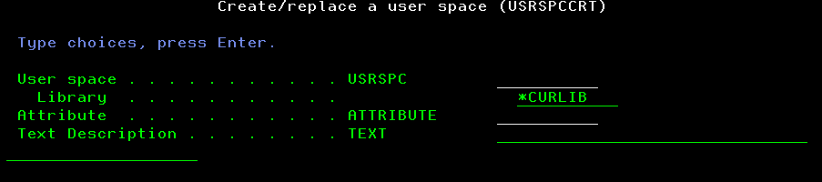

# User spaces Management

This set of tools provides ways to handle user spaces content from a program. It gets some inspiration from the famous TAATOOL suite of utilities, and more specifically, the [user spaces category](https://www.taatool.com/document/C_usrspc.html). These tools are intended to help managing the content of a user space filled up with the output of List APIs, such as QUSLJOB.

Two kinds of tools are expected in this topic.

The first one provides functions within an RPGLE service program, named USRSPC to create a user space, retrieve its information and attributes and retrieve its entries. They are intended to be used from a program. Let's start to name those functions:

1. UserSpaceCrt() to create a user space
2. UserSpaceRtvInf() to retrieve the information and attributes of a user space
3. UserSpaceRtvEnt() to retrieve the content of an entry of a user space

The second one provides CL commands to fulfill the same objectives. They are intended to be used from a CL(LE) program. They are using the functions as described above. Let's name those commands.

1. USRSPCCRT to create a user space
2. USRSPCRTVI to retrieve the information and attributes of a user space
3. USRSPCRTVE to retrieve an entry of a user space

## USRSPC service program

The service program contains the procedures related to user spaces management which are available for use by ILE programs.

### Common includes files used

The service program source makes use of the following includes files.

- inc_basic_declare.rpgle
- inc_stdapi_declare.rpgle
- inc_usrspc_declare.rpgle

### UserSpaceCrt() procedure

Input parameters are the following :

1. User space name
2. User space library
3. User space attribute
4. User space description text

Output parameter is the following :

1. Standard API error structure [ERRC0100](https://www.ibm.com/docs/en/i/7.5.0?topic=parameter-error-code-format#errorcodeformat__title__2)

The procedure makes use of [QUSCRTUS](https://www.ibm.com/docs/en/i/7.5.0?topic=ssw_ibm_i_75/apis/quscrtus.html) API.
Some of the parameters are forced as shown below :

- Initial size at 2000 bytes
- Initial content as blank
- Public authority as *LIBCRTAUT
- Automatic replacement as *YES
- Object domain as *DEFAULT
- Transfer size request as 0
- Optimum alignment as 1
- Automatic extendibility as 1

Other API parameters come from procedure parameters.

Error structure Bytes Provided value is set to 116 in order to optimize the content of ERRC0100 parameter.

#### Typical usage in RPGLE programs

Sources files to include:

- inc_basic_declare.rpgle
- inc_stdapi_declare.rpgle
- inc_usrspc_declare.rpgle

Invocation followed by ERRC0100 content handling to detect any error:

```RPGLE
ERRC0100 = UserSpaceCrt(UserSpace:Library:Attribute:Text);
if ExceptId <> Blank;
    dosomething;
else;
    dosomething;
endif;

```

#### Typical usage in CLLE programs

Source files to include:

- inc_stdapi_declare.clle

Invocation (notice to code the procedure name in upper case) followed by ERRC0100 content handling to detect any error:

```CLLE
CALLPRC PRC('USERSPACECRT') PARM(&USRSPC &USRSPCLIB &USRSPCATT &USRSPCTEXT) RTNVAL(&ERRC0100)
IF COND(&EXCEPTID *NE &BLANK) THEN( dosomething)
ELSE CMD(dosomethingelse)
```

## User space creation command

This action is done with USRSPCCRT command. The description of each parameter is the following:

|Parameter|Description|Choices|Notes|
|---------|-----------|-------|-----|
|USRSPC|User space and user space library||Mandatory, must be valid names, special value \*CURLIB for the library|
|ATTRIBUTE|User space attribute||Mandatory, must be a valid name|
|TEXT|Object description||Optional|



### Validity checker actions

The validity checker redoes all the checks which are done by command interface. It will never detect any issue when it is called by the command interface, but it might detect an issue in case the command processing program is directly used without the command interface. For more information about the standard for a validity checker program, checkout "ILE CL error routine within validity checker programs" in [Programming rules and conventions](../../Common/Programming%20rules%20and%20conventions.md).

Basically this program performs the following actions:

1. if USRSPC is not a valid name, set the error parameter status to TRUE and send CPD0071 \*DIAG message to caller program
2. if user space library is not \*CURLIB and not a valid name, set the error parameter status to TRUE and send CPD0071 \*DIAG message to caller program
3. if ATTRIBUTE is not a valid name, set the error parameter status to TRUE and send CPD0084 \*DIAG message to caller program
4. if there is at least one error, send CPF0002 \*ESCAPE message to caller program

In order to detect name validity, the program does the following. It tries to check the existence of a user profile object in QTEMP library with the value to check as the user profile name. There will never be a user profile outside of QSYS library. Therefore, if the name is valid, the program will detect a CPF9801 exception, and if the name is not valid, it will detect a CPD0078 diagnostic.

### Behavior of the command

The command processing program (CPP) is quite simple. It invokes the UserSpaceCrt procedure, then check the return code value. If there is no error, it sends back a USP0101 completion message from TOOMSGF message file. If there is an error, the exception id found in API error structure is sent back as an exception message.

### Source files used

|File|Object|Object type|Object attribute|Description|
|----|------|-----------|----------------|-----------|
|usrspccrt.cmd|USRSPCCRT|*CMD||Create a user space command|
|usrspccrt.pgm.clle|USRSPCCRT|*PGM|CLLE|Create a user space command processing program|
|usrspccrt0.pgm.clle|USRSPCCRT0|*PGM|CLLE|Create a user space command validity checker|

### Include files used

These sources files make use the following common includes files. For details about which one uses which one, review the sources.

- inc_variables_declare.clle
- inc_variables_init.clle
- inc_errorhandling_forchecker_declare.clle
- inc_errorhandling_forchecker_routine.clle
- inc_errorhandling.clle
- inc_stdapi_declare.clle

### Installation

Prior to perform any installation tasks, make sure that a TOOMSGF message file exists in the library where the programs reside. If needed, run the [TOOMSGF creation SQL](../toomsgf.msgf.sql) to create it.

Using Code4i and its local development and deployment capabilities, and Git/GitHub Desktopn are the easest ways to proceed.

1. Make sure to fork the repository from GitHub on your workstation
2. Deploy the project on your IBM i system
3. Make sure to properly set your current library
4. Run Actions on the sources below:
    - usp0101.msgid.sql
        Run SQL Statements
    - usrspc.srvpgm.rpgle
        Create RPG Module
        Create Service Program (with EXPORT(*ALL))
    - usrspccrt.clle
        Create Bound CL Program
    - usrspccrt0.clle
        Create Bound CL Program
    - usrspccrt.cmd
        Create Command
