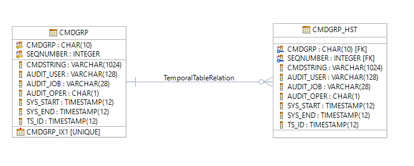
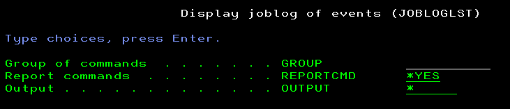
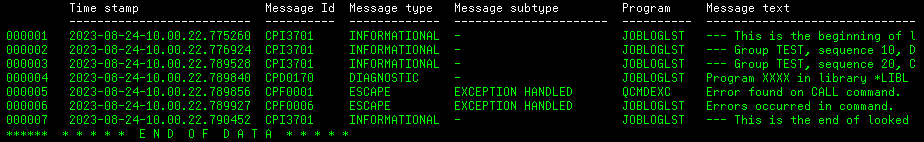
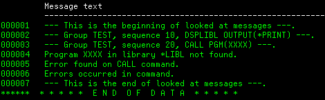

# Job log

This tool provides a way to report on display or print file the joblog which is related to run a set of commands. It was initiated after a [thread on Midrange.com mailing list](https://archive.midrange.com/midrange-l/202306/msg00354.html) where a gentleman was looking for a solution to display a joblog after running some commands.
The first version of this tool provides only a display (or print) output, based on a list of commands which exist in an SQL table (e.g. a physical file). In a future version there will be more stuff related to maintaining this table.

## Database definition

There is one table which is used to store the commands which are members of the same set or group. This is this group which is invoked by the tool.

The table name is CMDGRP and it has the following specifications:

- Columns
  - User updatable columns
    1. CMDGRP, char(10), this is a free identifiant which represents the group of commands from a user perspective
    2. SEQNUMBER, int, this a free sequence number in order to sort the commands of the group
    3. CMDSTRING, varchar(1024), this is the command to run
  - System updated columns
    1. AUDIT_USER, varchar(128), user profile which updated the row
    2. AUDIT_JOB, char(28), fully qualified job name which updated the row
    3. AUDIT_OPER, char(1), type of operation which updated the row (such as Inserted, Updated)
  - Temporal table columns; as a Proof Of Concept, it was decided to set the table as a temporal one and to set those columns as hidden as they are not really used during normal operations
    1. SYS_START, timestamp, beginning of valid time period of the row
    2. SYS_END, timestamp, end of valid time period for the row
    3. TS_ID, timestamp, transaction id of the row
- Primary keys
  1. Command group id
  2. Sequence number
- Index
  - Index One, CMDGRP_IX1; this index is not needed for performance issue as the access path is a duplicate of the system-maintained one to ensure primary keys consistency, but it is used by the programs below to ensure the proper order when running the commands; normally we should use a view (in place of an index) within programs but, it happens that an ORDER BY clause is not allowed at view creation time.
    1. Command group id
    2. Sequence number

The linked history table due to the temporal table setup is CMDGRP_HST. The system maintains needed columns and constraints to ensure data consistency between the live table and its history.

A graphical output of CMDGRP table is below.

## Database changes

With the first version of the tool, there is no other way to perform any database record change than using DFU or SQL.

## List job log

This action is done with *JOBLOGLST* command. The description of each parameter is the following:
|Parameter|Description|Choices|Notes|
|---------|-----------|-------|-----|
|GROUP|Group of commands||Mandatory, any value, special value \*ALL|
|REPORTCMD|Report commands|__*YES__, \*NO|Optional, default \*YES|
|OUTPUT|Output|__*__, *PRINT|Optional, default \*|

Recommended invokation for a regular usage is to keep the default, so either *JOBLOGLST GROUP(yourgroup)* or *JOBLOGLST GROUP(yourgroup) REPORTCMD(\*YES) OUTPUT(\*)* are both suitable.
Like regular operating system commands with such a parameter, if the command runs in batch, OUTPUT's parameter value is overriden to \*PRINT.

### Validity checker actions

The validity checker redoes all the checks which are done by command interface. It will never detect any issue when it is called by the command interface, but it might detect an issue in case the command processing program is directly used without the command interface. For more information about the standard for a validity checker program, checkout "ILE CL error routine within validity checker programs" in [Programming rules and conventions](https://github.com/MarcoDeSenas/IBMi-topics-thanks-to-pub400/blob/b52b70f3ebd7653c7503790c6ec5d2dfdccf0e96/Projects/Common/Programming%20rules%20and%20conventions.md).

Basically this program performs the following actions:

1. if GROUP is empty, set the error parameter status to TRUE and send CPD0071 *DIAG message to caller program
2. if REPORTCMD does not contain expected \*YES or \*NO value, set the error parameter status to TRUE and send CPD0084 *DIAG message to caller program
3. if OUTPUT does not contain expected \*YES or \*NO value, set the error parameter status to TRUE and send CPD0084 *DIAG message to caller program
4. if there is at least one error, send CPF0002 *ESCAPE message to caller program

### Behavior of the command

The command processing program (CPP) makes use of CMDGRP_IX1 database file to ensure it reads the list of commands to run them in the appropriate order. Then it will leverage the [QSYS2.JOBLOG_INFO](https://www.ibm.com/docs/en/i/7.5?topic=services-joblog-info-table-function) table function to show the output of each command. This table is used by a QM Query to show the output in a nicely formatted manner.

It sets the job's LOGCLPGM attribute to \*NO if it is not the case (and sets it back to its initial value once the work is done) to reduce risk of joblog pollution.

There is a general error monitoring when running all commands from commands groups, and therefore the monitoring messages will show in the output.

Basically, the CPP performs the following tasks:

1. check the proper number of parameters in case the program is not called through command interface; CPX6148 *ESCAPE message is sent to itself in order to activate the standard error handling routine
2. call the validity checker program in case the program is not called through command interface
3. set LOGCLPGM value to \*NO
4. send a specific message to the joblog to mark the beginning of events that we want to review; the message key of this message is used by the QM Query to narrow the joblog
5. loop to read the content of CMDGRP_IX1 file
   - for
     - either each record of the command group received in GROUP paramater
     - or all records if GROUP parameter contains the \*ALL special value
   - if requested with REMPORTCMD(\*YES) parameter, send a marker message to recall the group, sequence and command string
   - execute the command
   - note that the program may read more records than needed if GROUP parameter does not contain *ALL special value
6. send a specific message to the joblog to mark the end of events that we want to review; the message key of this message is used by the QM Query to narrow the joblog
7. if needed set back LOGCLPGM value
8. format both message key beginning and message key end variables used by the QM Query
9. if either running in batch or OUTPUT(*PRINT) required, enlarge (to fit columns length) and rename QPQXPRTF printer file
10. run the QM Query

Below are some examples with the TEST commands group as below.

|Commands group|Sequence number|Command string|SQL statement to insert the row|
|----|------|-----------|------------|
|TEST|10|DSPLIBL OUTPUT(\*PRINT)|insert into CMDGRP (CMDGRP, SEQNUMBER, CMDSTRING) values('TEST', 10, 'DSPLIBL OUTPUT(*PRINT)')|
|TEST|20|CALL PGM(XXXX)|insert into CMDGRP (CMDGRP, SEQNUMBER, CMDSTRING) values('TEST', 20, 'CALL PGM(XXXX)')|

An example of the output of the JOBLOGLST GROUP(TEST) REPORTCMD(\*YES) OUTPUT(\*) is below.

The print output for the same example is in this [file](Assets/jobloglst_example1.txt).

### Sources files used

|File|Object|Object type|Object attribute|Description|
|----|------|-----------|----------------|-----------|
|jobloglst.cmd|JOBLOGLST|*CMD||Job log list command|
|jobloglst.pgm.clle|JOBLOGLST|*PGM|CLLE|Job log list command processing program|
|jobloglst0.pgm.clle|JOBLOGLST0|*PGM|CLLE|Job log list command validity checker|
|jobloglst.qmqry|JOBLOGLST|*QMQRY||Job log list QM Query|
|jobloglst.qmqry|JOBLOGLST|*QMFORM||Job log list QM Form|

Note about \*QMQRY and \*QMFORM sources and objects:

- there is no IBM i support for creating those objects types from an IFS stream file; however, I have a personal requirement to use github.com (and Github Gesktop) for sources follow-up and repository, therefore it is much more easy within VSCode to use IFS files; however they should not be directly updated but rather, in case of needed modification, they should be copied from a physical source file member created with RTVQMQRY and RTVQMFORM commands
- those objects were initially created from STRQM command, then their source was created in a physical source file with RTVQMQRY and RTVQMFORM commands, then the sources were copied in IFS stream files
- the Installation section below provides instructions on the way to create the objects from those IFS stream files

### Common includes files used

These sources files make use the following common includes files. For details about which one uses which one, review the sources.

- inc_variables_declare.clle
- inc_variables_init.clle
- inc_errorhandling_forchecker_declare.clle
- inc_errorhandling_forchecker_routine.clle
- inc_errorhandling.clle

## Installation

Several steps are needed for installing the utility.
The prerequisite is to create the directory structure within HOME directory. This can be done once for all the tools from this GitHub repository.

1. Download into a local workstation directory from Github the [folder structure creation SQL script](../Common/folder_structure_creation.sql) script.
   - __important notice__: the script assumes that the projects directory will be a subdirectory of HOME directory __and__ that this HOME directory is named /home/USERPROFILE; however, as long as its internal structure remains the same, the projects directory can be anywhere, and INCLUDE statements in the sources should work; but, if it is decided to install projects directory elsewhere than below /home/USERPROFILE, script must be updated to set the parent directory as the current directory before running the CRTDIR CL commands
2. Execute it from iACS Run SQL Scripts

Further step are specifically related to JOBLOG tool.

1. Download all inc* files from Github repository into the desired directory on the system
2. Download into a local workstation directory from Github the [CMDGRP database](cmdgrp.sql) script
3. Execute it from iACS Run SQL Scripts; it will ask for the library to create the database into
   - Warning, the script first deletes CMDGRP table if it exists; make sure to keep a copy somewhere of existing data somewhere; in a future version, it is planned to avoid deleting the table
4. Download the sources of objects from Github into the desired directory on the system
   1. [JOBLOGLST command](jobloglst.cmd)
   2. [JOBLOGLST command processing programe](jobloglst.pgm.clle)
   3. [JOBLOGLST command validity checker](jobloglst0.pgm.clle)
   4. [JOBLOGLST QM Query](jobloglst.qmqry)
   5. [JOBLOGLST QM Form](jobloglst.qmform)
5. Download into a local workstation directory from Github the [JOBLOG build](joblog_build.sql) script
6. If it was decided not to keep the same directory structure as described in this [Projects organization](../README.md) document, review all INCLUDE statements in programs sources and review build script to update source file location in order to handle the modification
7. Execute it from iACS Run SQL Scripts; it will ask for the projects parent directory fullpath and library to create the objects into; the script runs CRTQMQRY and CRTQMFORM commands which seem to have an issue with REPLACE(*YES) parameter on PUB400, which means that the commands send an inquiry message to ask for replacement confirmation; to avoid that, the script includes two commented DLTOBJ commands which must be uncommented if the script runs more than one time for the same library
8. Populate CMDGRP table with a couple of commands and run a test

Enjoy looking at your job log!
